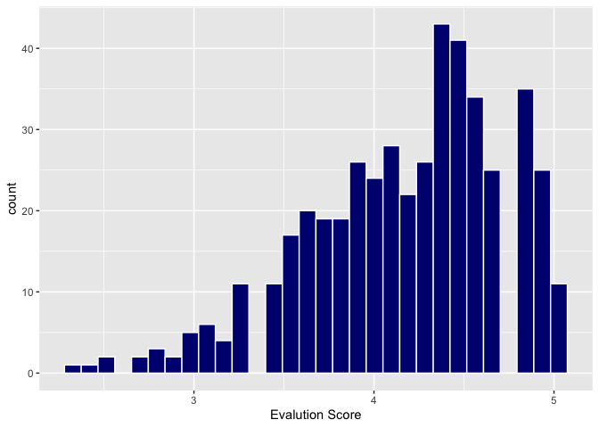

Lab 09 - Grading the professor, Pt. 1
================
Marcus Minko
02-28-2022

### Load packages and data

``` r
library(tidyverse) 
library(broom)
library(openintro)
```

### View Data Distribrution

``` r
evals %>% 
  ggplot(aes(x = score)) + geom_histogram (bindwidth = .25, color = "white", fill = "navy") +
  labs(x = "Evalution Score")
```

    ## Warning: Ignoring unknown parameters: bindwidth

    ## `stat_bin()` using `bins = 30`. Pick better value with `binwidth`.

<!-- -->

``` r
evals %>% 
  summarize (mean(score), median(score), min(score), max(score))
```

    ## # A tibble: 1 × 4
    ##   `mean(score)` `median(score)` `min(score)` `max(score)`
    ##           <dbl>           <dbl>        <dbl>        <dbl>
    ## 1          4.17             4.3          2.3            5

``` r
# score distribution is somewhat left-skewed; in general, students give pretty scores

evals %>% 
  ggplot(aes(x = score, y = bty_avg)) + 
  geom_point() + 
  labs(y = "Beauty Rating", x = "Evalution Score")
```

<!-- -->

``` r
evals %>% 
  ggplot(aes(x = score, y = bty_avg)) + 
  geom_jitter() +
  labs(y = "Beauty Rating", x = "Evalution Score")
```

<!-- -->

``` r
#The geom_point plot looks like there are fewer data than there actually is
```

### Linear Regression Model

``` r
m_bty = lm(score~bty_avg, data = evals) #Create the linear regression
summary(m_bty)
```

    ## 
    ## Call:
    ## lm(formula = score ~ bty_avg, data = evals)
    ## 
    ## Residuals:
    ##     Min      1Q  Median      3Q     Max 
    ## -1.9246 -0.3690  0.1420  0.3977  0.9309 
    ## 
    ## Coefficients:
    ##             Estimate Std. Error t value Pr(>|t|)    
    ## (Intercept)  3.88034    0.07614   50.96  < 2e-16 ***
    ## bty_avg      0.06664    0.01629    4.09 5.08e-05 ***
    ## ---
    ## Signif. codes:  0 '***' 0.001 '**' 0.01 '*' 0.05 '.' 0.1 ' ' 1
    ## 
    ## Residual standard error: 0.5348 on 461 degrees of freedom
    ## Multiple R-squared:  0.03502,    Adjusted R-squared:  0.03293 
    ## F-statistic: 16.73 on 1 and 461 DF,  p-value: 5.083e-05

``` r
evals %>% 
ggplot(aes(x=score, y=bty_avg)) + 
  geom_point()+
  geom_smooth(method=lm, 
              linetype="solid") +
  geom_jitter() +
  labs(y = "Beauty Rating", x = "Evalution Score")
```

    ## `geom_smooth()` using formula 'y ~ x'

<!-- -->

``` r
#Regression line orange, no shading for error

m_bty = lm(score~bty_avg, data = evals) #Create the linear regression
summary(m_bty)
```

    ## 
    ## Call:
    ## lm(formula = score ~ bty_avg, data = evals)
    ## 
    ## Residuals:
    ##     Min      1Q  Median      3Q     Max 
    ## -1.9246 -0.3690  0.1420  0.3977  0.9309 
    ## 
    ## Coefficients:
    ##             Estimate Std. Error t value Pr(>|t|)    
    ## (Intercept)  3.88034    0.07614   50.96  < 2e-16 ***
    ## bty_avg      0.06664    0.01629    4.09 5.08e-05 ***
    ## ---
    ## Signif. codes:  0 '***' 0.001 '**' 0.01 '*' 0.05 '.' 0.1 ' ' 1
    ## 
    ## Residual standard error: 0.5348 on 461 degrees of freedom
    ## Multiple R-squared:  0.03502,    Adjusted R-squared:  0.03293 
    ## F-statistic: 16.73 on 1 and 461 DF,  p-value: 5.083e-05

``` r
ggplot(evals, aes(x=score, y=bty_avg)) + 
  geom_point()+
  geom_smooth(method=lm, se=FALSE, linetype="solid",
             color="orange") +
        geom_jitter() +
  labs(y = "Beauty Rating", x = "Evalution Score")
```

    ## `geom_smooth()` using formula 'y ~ x'

<!-- --> score =
3.88 + .07(bty_avg)

Slope = .07, significant p-value. So for every one-unit increase in
beauty score, there is a .07 increase in the prof evaluation score

Intercept: For a beauty of zero, you would expect an prof evaluation
score of 3.88. This doesn’t make much sense, since a score of zero is
not possible (scales 1-10)

R-squared = 0.04, beauty rating accounts for 4% of the variance in
average professor evaluation scores.

### Regression line & Gender

``` r
m_gen = lm(score~gender, data = evals)
summary(m_gen)
```

    ## 
    ## Call:
    ## lm(formula = score ~ gender, data = evals)
    ## 
    ## Residuals:
    ##      Min       1Q   Median       3Q      Max 
    ## -1.83433 -0.36357  0.06567  0.40718  0.90718 
    ## 
    ## Coefficients:
    ##             Estimate Std. Error t value Pr(>|t|)    
    ## (Intercept)  4.09282    0.03867 105.852  < 2e-16 ***
    ## gendermale   0.14151    0.05082   2.784  0.00558 ** 
    ## ---
    ## Signif. codes:  0 '***' 0.001 '**' 0.01 '*' 0.05 '.' 0.1 ' ' 1
    ## 
    ## Residual standard error: 0.5399 on 461 degrees of freedom
    ## Multiple R-squared:  0.01654,    Adjusted R-squared:  0.01441 
    ## F-statistic: 7.753 on 1 and 461 DF,  p-value: 0.005583

``` r
#y= .14(x) + 4.09 
#males: y = .14(0) + 4.09 predicted score for males is 4.09
#females: y = .14(1) + 4.09 predicted score for females is 4.23

m_rank = lm(score~rank, data = evals)
summary(m_rank)
```

    ## 
    ## Call:
    ## lm(formula = score ~ rank, data = evals)
    ## 
    ## Residuals:
    ##     Min      1Q  Median      3Q     Max 
    ## -1.8546 -0.3391  0.1157  0.4305  0.8609 
    ## 
    ## Coefficients:
    ##                  Estimate Std. Error t value Pr(>|t|)    
    ## (Intercept)       4.28431    0.05365  79.853   <2e-16 ***
    ## ranktenure track -0.12968    0.07482  -1.733   0.0837 .  
    ## ranktenured      -0.14518    0.06355  -2.284   0.0228 *  
    ## ---
    ## Signif. codes:  0 '***' 0.001 '**' 0.01 '*' 0.05 '.' 0.1 ' ' 1
    ## 
    ## Residual standard error: 0.5419 on 460 degrees of freedom
    ## Multiple R-squared:  0.01163,    Adjusted R-squared:  0.007332 
    ## F-statistic: 2.706 on 2 and 460 DF,  p-value: 0.06786

``` r
#y= 4.28 -.13(X1) + -.15(X2)
#predicted score for teaching rank is 4.28
#predicted score for tenure track is 4.15
#predicted score for tenured is 4.13
```

### Relevel Rank positions

``` r
rank_evals <- evals%>%
  mutate(rank_relevel = case_when(rank== "tenure track" ~ 0,
                          rank== "teaching" ~ 1,
                          rank== "tenured" ~ 2))
m_rank_relevel<- lm( score~ rank_relevel, data = rank_evals) #Create the linear regression
summary(m_rank_relevel)
```

    ## 
    ## Call:
    ## lm(formula = score ~ rank_relevel, data = rank_evals)
    ## 
    ## Residuals:
    ##     Min      1Q  Median      3Q     Max 
    ## -1.9032 -0.3599  0.1185  0.4185  0.8401 
    ## 
    ## Coefficients:
    ##              Estimate Std. Error t value Pr(>|t|)    
    ## (Intercept)   4.20317    0.04751  88.463   <2e-16 ***
    ## rank_relevel -0.02166    0.03063  -0.707     0.48    
    ## ---
    ## Signif. codes:  0 '***' 0.001 '**' 0.01 '*' 0.05 '.' 0.1 ' ' 1
    ## 
    ## Residual standard error: 0.5442 on 461 degrees of freedom
    ## Multiple R-squared:  0.001084,   Adjusted R-squared:  -0.001083 
    ## F-statistic:   0.5 on 1 and 461 DF,  p-value: 0.4798

``` r
#y = 4.2 - .02(rank)
#each step up the rank is associated with a .02 decrease in prof eval score (non-significant)
#rank only accounts for .001 percent of variance in prof eval score.
```

###Tenure Eligibility

``` r
evals <- evals%>% 
  mutate(tenure_eligible = if_else(rank == "teaching", "No", "Yes"))

#Regression line based on tenure eligibility

m_tenure_eligible = lm(score ~ tenure_eligible, data = evals) 
summary(m_tenure_eligible)
```

    ## 
    ## Call:
    ## lm(formula = score ~ tenure_eligible, data = evals)
    ## 
    ## Residuals:
    ##     Min      1Q  Median      3Q     Max 
    ## -1.8438 -0.3438  0.1157  0.4360  0.8562 
    ## 
    ## Coefficients:
    ##                    Estimate Std. Error t value Pr(>|t|)    
    ## (Intercept)          4.2843     0.0536  79.934   <2e-16 ***
    ## tenure_eligibleYes  -0.1406     0.0607  -2.315    0.021 *  
    ## ---
    ## Signif. codes:  0 '***' 0.001 '**' 0.01 '*' 0.05 '.' 0.1 ' ' 1
    ## 
    ## Residual standard error: 0.5413 on 461 degrees of freedom
    ## Multiple R-squared:  0.0115, Adjusted R-squared:  0.009352 
    ## F-statistic: 5.361 on 1 and 461 DF,  p-value: 0.02103

``` r
## y = 4.28 -.14(tenure_eligible)
# tenure eligible faculty have predicted prof eval scores .14 lower (4.14) than non-tenure eligible faculty (4.28)
#R-squared: tenure eligibility accounted for .01 percent of the variance in prof evaluation score
```
